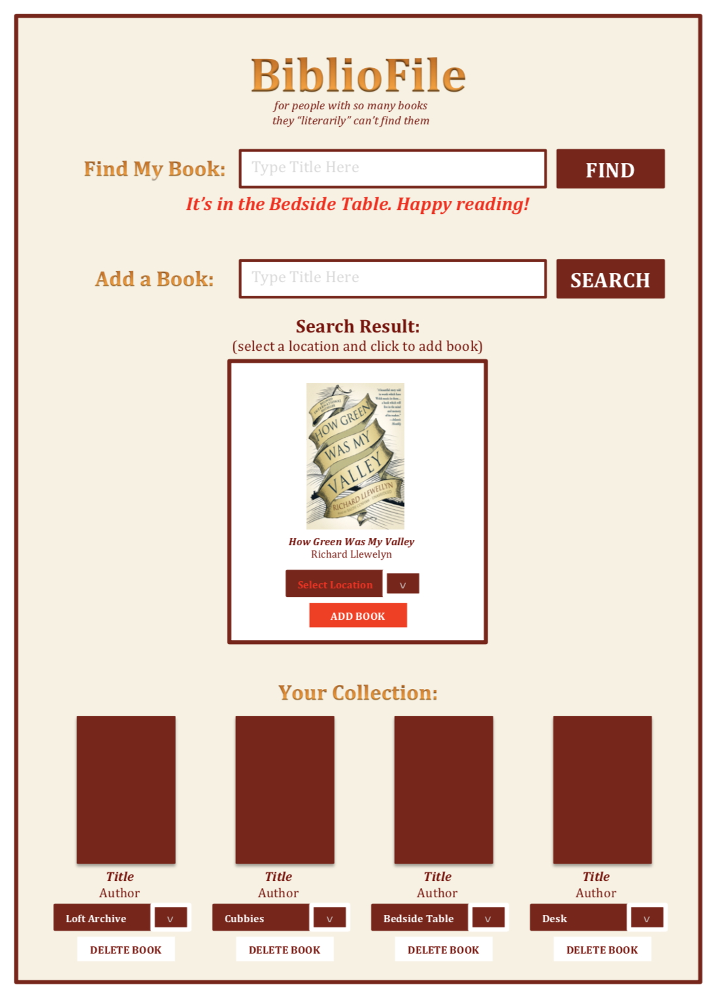
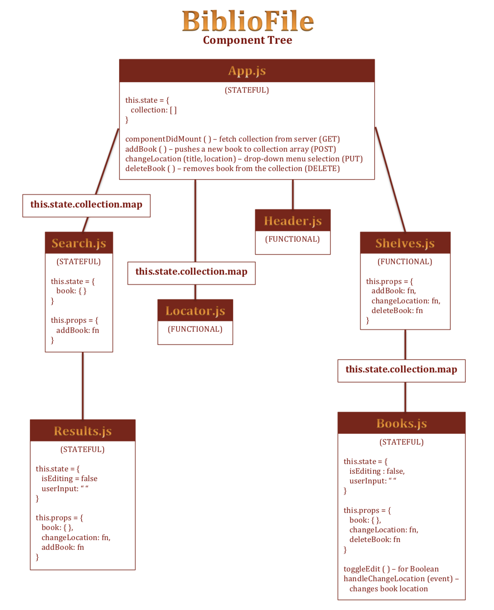

# BiblioFile
*for people who own so many books they "literarily" can't find them*

## Concept

- This tracking app organizes and displays the user's books according to physical location.
- Data will be retrieved from a localized JSON (no DB or API).
- The app supports full CRUD, including methods to return the user's book collection, retrieve a book from the JSON array, add a new book, update a book's location, and delete a book from the user's collection.

## Functionality
- The app displays two search bars, a result box, and the user's collection of books.
- The "Find My Book" search bar, activated with the "Find" button, will search for a book in the user's current collection and return a string of that book's location.
- The "Add a Book" search bar, activated with the "Search" button, will search the JSON array for the book's title and display a mock-up of the book in the result box, where users can select a location and click the "Add Book" button to push the book to their collection.
- The collection below displays an array of the user's books, including each book's cover, title, author, a drop-down menu to adjust its location, and a "Delete" button to remove it from the collection.

## Endpoints
- GET - returns a complete array of the user's book collection
- GET - retrieves a book from the JSON array by title
- POST - allows users to add search results to their collection
- PUT - updates a book's current location
- DELETE - removes a book from the array

## Component Architecture
- ***App.js*** - a stateful component that holds an array of the user's book collection and contains methods to get, post, put, and delete books
    - ***Header.js*** - a functional component that displays the app's title and slogan
    - ***Locator.js*** - a functional component that returns a string of the book's location when the "Find" button is activated
    - ***Search.js*** - a stateful component that holds a book object mapped from App.js and renders it in the search box for user interaction
        - ***Results.js*** - a stateful component that holds a boolean to determine if the user has clicked on the location dropdown icon then performs passed methods to change a book's location and add it to the collection
    - ***Shelves.js*** - a functional component that displays the user's collection, including any books it receives as props from Books.js
        - ***Books.js*** - a stateful component that holds a book array and provides information to the Shelves for rendering

## Wireframe

## Component Tree

===========================================

This project was bootstrapped with [Create React App](https://github.com/facebook/create-react-app).

## Available Scripts

In the project directory, you can run:

### `npm start`

Runs the app in the development mode. 
Open [http://localhost:3000](http://localhost:3000) to view it in the browser.

The page will reload if you make edits. 
You will also see any lint errors in the console.

### `npm test`

Launches the test runner in the interactive watch mode. 
See the section about [running tests](https://facebook.github.io/create-react-app/docs/running-tests) for more information.

### `npm run build`

Builds the app for production to the `build` folder. 
It correctly bundles React in production mode and optimizes the build for the best performance.

The build is minified and the filenames include the hashes. 
Your app is ready to be deployed!

See the section about [deployment](https://facebook.github.io/create-react-app/docs/deployment) for more information.

### `npm run eject`

**Note: this is a one-way operation. Once you `eject`, you can’t go back!**

If you aren’t satisfied with the build tool and configuration choices, you can `eject` at any time. This command will remove the single build dependency from your project.

Instead, it will copy all the configuration files and the transitive dependencies (webpack, Babel, ESLint, etc) right into your project so you have full control over them. All of the commands except `eject` will still work, but they will point to the copied scripts so you can tweak them. At this point you’re on your own.

You don’t have to ever use `eject`. The curated feature set is suitable for small and middle deployments, and you shouldn’t feel obligated to use this feature. However we understand that this tool wouldn’t be useful if you couldn’t customize it when you are ready for it.

## Learn More

You can learn more in the [Create React App documentation](https://facebook.github.io/create-react-app/docs/getting-started).

To learn React, check out the [React documentation](https://reactjs.org/).

### Code Splitting

This section has moved here: https://facebook.github.io/create-react-app/docs/code-splitting

### Analyzing the Bundle Size

This section has moved here: https://facebook.github.io/create-react-app/docs/analyzing-the-bundle-size

### Making a Progressive Web App

This section has moved here: https://facebook.github.io/create-react-app/docs/making-a-progressive-web-app

### Advanced Configuration

This section has moved here: https://facebook.github.io/create-react-app/docs/advanced-configuration

### Deployment

This section has moved here: https://facebook.github.io/create-react-app/docs/deployment

### `npm run build` fails to minify

This section has moved here: https://facebook.github.io/create-react-app/docs/troubleshooting#npm-run-build-fails-to-minify
